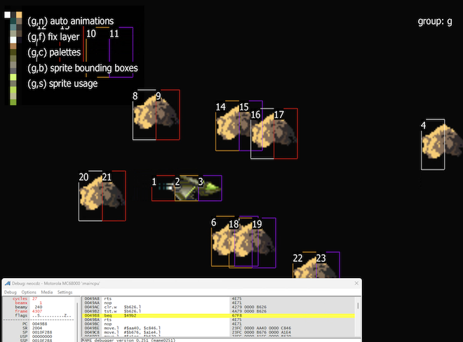
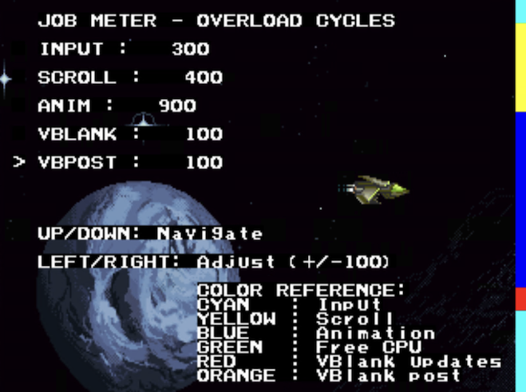

# NeoCore

<p align="center">
  
</p>

     

  

## 🎯 Overview<a name="overview"></a>

NeoCore is a library and toolchain for developing on Neo Geo CD.

It provides high-level functions over Neo Dev Kit and DATlib 0.3, and includes tools and code that can help with projects on this platform.

### ✨ Key Features
- 🚀 **High abstraction level** for Neo Geo CD development
- 🔧 **Toolchain** with PowerShell scripts
- 🎮 **Compatible** with Windows 11
- 📖 **Documentation** generated with Doxygen
- 🔄 **Hot reload** for rapid development

### 🔗 Quick Links
- [💬 Discord](https://discord.com/channels/1330066799445676093/1330089958798790686)
- [🐛 Report a Bug](https://github.com/David-Vandensteen/neocore/issues/new?labels=bug&template=bug_report.md)
- [💡 Request a Feature](https://github.com/David-Vandensteen/neocore/issues/new?labels=enhancement&template=feature_request.md)
- [📋 Migration from previous versions](docs/migration_guides/v2tov3/v2tov3.md)
- [📚 API Documentation](http://azertyvortex.free.fr/neocore-doxy/r12/neocore_8h.html)
- [📝 Changelog](CHANGELOG.md)

> ⚠️ **Upgrading from v2.x?** This version includes **breaking changes**. Please check the [migration guide](docs/migration_guides/v2tov3/v2tov3.md) before upgrading from NeoCore 2.x to 3.x.

## 📚 Table of Contents
- [🎯 Overview](#overview)
- [📋 Requirements](#requirements)
- [📅 Roadmap](#roadmap)
- [🚀 Quick Start](#quick-start)
- [⚙️ Command Reference](#command-reference)
  - [🔨 Development Cycle](#development-cycle)
  - [🧪 Validation & Tools](#validation--tools)
  - [📦 Distribution](#distribution)
  - [ℹ️ Information](#information)
  - [🎮 Custom Emulator Profiles](#emulator-profiles)
  - [🐞 Debug Mode with ngdev Plugin](#debug-mode-with-ngdev-plugin)
- [🔧 Development Workflow](#development-workflow)
  - [C89/ANSI C Strict Compliance](#c89ansi-c-strict-compliance)
  - [Build Steps (v3.0.0+)](#build-steps-v300)
- [📦 Project Management](#project-management)
  - [🆕 Create a Project](#create-a-project)
  - [🆙 Upgrade a Project](#upgrade-an-existing-project)
  - [📤 Release a Project](#release-a-project)
- [📖 Documentation & Resources](#documentation--resources)
  - [📚 C API Documentation](#documentation-of-neocore-c-lib)
  - [🎨 DATlib Assets](#datlib-assets)
- [📊 Profiling](#profiling)
- [🎵 Audio Configuration](#audio-configuration)
- [🛠️ Advanced Development](#advanced-development)
  - [♻️ Hot Reload](#hot-reload)
  - [🔧 Compile Library](#compiling-the-lib)
  - [🌿 Branches & Versions](#pull-or-checkout-another-branches)
- [🤝 Contribution](#contribute)
  - [🎮 Game Examples & Showcases](#examples)
- [📚 Dependencies](#dependencies)

---

## Requirements<a name="requirements"></a>
* Up to date Windows 11
* Git [https://git-scm.com/download/win](https://git-scm.com/download/win)
* Windows Terminal with cmd instance (shortcut win + r and type `wt cmd`)

---

## 📅 Roadmap<a name="roadmap"></a>

### 🟢 Completed (v3.4.0)
- ✅ neocore version switcher script for standalone projects
- ✅ One-liner command for project creation
- ✅ Mak lint command for project validation
- ✅ Integrate city41/mameNeoGeoDevPlugin (use `\.\mak.bat run:mame:debug` to enable it)
  - ✅ Fork and tweak for NeoCore - [neocore-mameNeoGeoDevPlugin](https://github.com/David-Vandensteen/neocore-mameNeoGeoDevPlugin)
  - ✅ Add Windows compatibility
  - ✅ Add Neo-Geo CD MAME compatibility
  - ✅ Upgrade MAME for plugin API compatibility

### 🟢 Completed (v3.4.1)
- ✅ Upgrade Raine emulator to 0.97.5
- ✅ Fix issue 211: Incorrect CUE file paths when generating ISO with MP3 CDDA tracks (mak dist:iso)

### 🟢 Completed (v3.4.3)
- ✅ DATlib JobMeter
  - ✅ Sample demo: [job_meter](samples/job_meter/)
- ✅ Automatic generation of a structure aggregating a pointer to sprite data in ROM  
  and a pointer to palette information in ROM during sprite compilation

### 🟡 In Progress

### 🔵 Planned - Soon
- 🔜 Runtime palette creation: instantiate sprites with palettes built in RAM _(may be delayed after NeoCore 4)_

### 🔵 Planned - Later
- 🔜 NeoCore 4
  - Remove deprecated functions, macros and structures since NeoCore 3.1.1
  - Refactor nc_gfx* functions
- 🔜 AES / MVS support (**5% completed**)
  - ✅ Externalized CDDA functions (completed in v3.4.4)
  - ✅ Added auto-generated `out/platform.h` to define the platform type (CD or Cartridge) (completed in v3.4.4)
  - 🔜 Lib CD Makefile
  - 🔜 Lib Cartridge Makefile
  - 🔜 Generate hash and rom file for Mame
- 🔜 Add basic modular C lib system for reusable functions and assets
- 🔜 RGB palette handlers (**60% completed**)
  - Samples: `pal_backdrop`, `pal_rgb`, `pal_rgb_mixer`
- 🔜 Joypad 2 support
- 🔜 Improve sound FX management
  - Evaluate [Mezz-Estate-NeoGeo-Audio-Driver](https://github.com/neogeo-mzs/Mezz-Estate-NeoGeo-Audio-Driver)
- 🔜 Palette bank switcher
- 🔜 DRAM asset management (unload/load from CD-ROM)

### 🧐 Under Consideration
 - 💭 Split project.xml to separate user parameters from toolchain parameters
 - 💭 Video recording support (MAME MNG format with manual ffmpeg conversion to MP4)
 - 💭 XML WYSIWYG editor
 - 💭 Memory card support
 - 💭 CLI-based asset packager
 - 💭 Split project.xml to separate user parameters from toolchain parameters
 - 💭 GCC upgrade to version > 2.95.2
   - Evaluate DATlib → libNG ([TheHpman/libNG](https://github.com/TheHpman/libNG))
 - 💭 Raine version selection
 - 💭 MAME version selection

---

## 🚀 Quick Start<a name="quick-start"></a>

### Which method should I use?


#### 🟢 Most users: **No cloning required!**

If you want to **create your own NeoGeo CD game or app**, you do NOT need to clone this repository.

👉 **Just use the one-liner below to initialize your project.**
This will always fetch the latest stable version and set up everything for you automatically.

#### 🛠️ When should you clone the repo?

You only need to clone this repository if you want to:
- Explore or run the included samples and demos
- Contribute to the NeoCore toolchain or C library
- Develop, debug, or customize the NeoCore internals

For 99% of new projects, the one-liner is all you need!


### Three-Step Setup

**2️⃣ Create Your Project**

> 💡 **No need to clone or download NeoCore** - the script does everything for you!
> 
> ⚠️ Avoid spaces in paths (use `C:\MyGame` not `C:\My Game`)

```cmd
md C:\MyGame && cd C:\MyGame
````
```cmd
curl -L https://raw.githubusercontent.com/David-Vandensteen/neocore/master/bootstrap/scripts/project/create_from_oneliner.bat -o c.bat && c.bat && del c.bat
```
```cmd
cd src
```
```cmd
.\mak.bat sprite && .\mak.bat && .\mak.bat run:mame
```

**3️⃣ Next Steps**
- 📖 **Important**: Review [C89 Compliance](#c89ansi-c-strict-compliance) rules before coding
- 📋 See [Command Reference](#command-reference) for all build commands
- 🎮 Explore [Custom Emulator Profiles](#emulator-profiles) for testing
- 🗂️ Read [Project Management](#project-management) for advanced project setup

---

## ⚙️ Command Reference<a name="command-reference"></a>

> ⚠️ **Warning**: The mak script overrides the PATH environment variable during compilation. If you encounter any problems after using it, simply close and restart a new command terminal.

### 🔨 Development Cycle

**Building:**
| Command | Description |
|---------|-------------|
| `.\mak.bat sprite` | Build sprites from assets |
| `.\mak.bat` | Compile C code and link |
| `.\mak.bat lib` | Compile NeoCore library |
| `.\mak.bat clean` | Remove built resources |
| `.\mak.bat clean:build` | Remove entire build folder |

**Testing:**
| Command | Description |
|---------|-------------|
| `.\mak.bat run:raine` | Run with Raine emulator |
| `.\mak.bat run:mame` | Run with MAME emulator |
| `.\mak.bat run:mame:debug` | Run with MAME in debug mode (ngdev plugin) |
| `.\mak.bat serve:mame` | Run in hot reload mode |

### 🧪 Validation & Tools

| Command | Description |
|---------|-------------|
| `.\mak.bat lint` | Validate project (project.xml, .gitignore, legacy code) |
| `.\mak.bat framer` | Launch DATlib Framer |
| `.\mak.bat animator` | Launch DATlib Animator |

### 📦 Distribution

| Command | Description |
|---------|-------------|
| `.\mak.bat dist:iso` | Create ISO distribution package |
| `.\mak.bat dist:mame` | Create MAME distribution package |
| `.\mak.bat dist:exe` | Create Windows standalone executable |

### ℹ️ Information

| Command | Description |
|---------|-------------|
| `.\mak.bat --version` | Display version information |

### 🎮 Custom Emulator Profiles<a name="emulator-profiles"></a>

You can create custom emulator profiles for different testing scenarios.
NeoCore comes with default profiles (`default`, `full`, `nosound`, `debug` for MAME), but you can add your own.

**Creating Custom MAME Profiles:**

Add custom profiles to your `project.xml`:
```xml
<project>
  <emulator>
    <mame>
      <profile>
        <!-- Default profiles are already included -->
        <myprofile>-window -skip_gameinfo -throttle neocdz</myprofile>
        <benchmark>-window -skip_gameinfo -nothrottle -bench 60 neocdz</benchmark>
        <record>-window -skip_gameinfo -aviwrite output.avi neocdz</record>
      </profile>
    </mame>
  </emulator>
</project>
```

**Creating Custom Raine Configurations:**

Create custom config files in your project and reference them:
```xml
<project>
  <emulator>
    <raine>
      <config>
        <!-- Default configs are already included -->
        <myconfig>raine\config\myconfig.cfg</myconfig>
        <test>raine\config\test.cfg</test>
      </config>
    </raine>
  </emulator>
</project>
```

**Usage:**
```cmd
# Use your custom MAME profiles
.\mak.bat run:mame:myprofile
.\mak.bat run:mame:benchmark
.\mak.bat run:mame:record

# Use your custom Raine configs
.\mak.bat run:raine:myconfig
.\mak.bat run:raine:test

# Default profiles (included with NeoCore)
.\.mak.bat run:mame:full      # Fullscreen
.\mak.bat run:mame:debug     # Debug mode with ngdev plugin
.\mak.bat run:raine:full     # Fullscreen
```

### 🐞 Debug Mode with ngdev Plugin

The `debug` profile provides enhanced Neo Geo CD debugging capabilities:

```cmd
.\mak.bat run:mame:debug
```



**Plugin Information:**
- Automatically installed
- Based on [city41/mameNeoGeoDevPlugin](https://github.com/city41/mameNeoGeoDevPlugin)
- Forked and enhanced for NeoCore: [neocore-mameNeoGeoDevPlugin](https://github.com/David-Vandensteen/neocore-mameNeoGeoDevPlugin)
- Profile is automatically maintained by NeoCore


---

## 🔧 Development Workflow

### C89/ANSI C Strict Compliance

> ⚠️ **CRITICAL**: This project uses `gcc-2.95.2` and requires strict C89 (ANSI C) compliance.

**Key Rules:**
- Declare all variables at the beginning of blocks
- Declare loop variables outside loops
- No mixed declarations and code

<details>
<summary>📖 Click for C89 compliance examples</summary>

**1. All variables must be declared at the beginning of blocks:**

```c
/* ✅ CORRECT */
int function(void) {
    int i;
    char* buffer;

    i = 0;
    buffer = NULL;
    /* code here */
}

/* ❌ WRONG - will not compile */
int function(void) {
    int i = 0;
    doSomething();
    char* buffer = NULL;  /* ERROR: declaration after statement */
}
```

**2. Loop variables must be declared outside loops:**

```c
/* ✅ CORRECT */
int i;
for (i = 0; i < 10; i++) {
    /* code */
}

/* ❌ WRONG */
for (int i = 0; i < 10; i++) {  /* ERROR: C99+ feature */
    /* code */
}
```

**3. No inline variable initialization in declarations (unless constant):**

```c
/* ✅ CORRECT */
int x;
x = getValue();

/* ❌ WRONG (unless getValue() is a constant) */
int x = getValue();
```

</details>

### Build Steps (v3.0.0+)

Starting with version 3.0.0, build steps are now explicit and must be executed manually for better control and performance optimization:

#### Development Workflows

```bash
# Initial development (build everything)
.\mak.bat sprite && .\mak.bat && .\mak.bat run:raine

# Code-only modifications (sprites unchanged)
.\mak.bat && .\mak.bat run:raine  # ⚡ Faster!

# Quick test without recompilation
.\mak.bat run:raine  # 🚀 Instant!
```

#### Build Step

| Step | Command | Purpose | When to use |
|------|---------|---------|-------------|
| **1. Sprites** | `.\mak.bat sprite` | Generate sprite data from assets | When assets change |
| **2. Compile** | `.\mak.bat` | Compile C code and link | When code changes |
| **3. Run** | `.\mak.bat run:raine` | Launch in emulator | Always for testing |

---

## 📦 Project Management<a name="project-management"></a>

### 🆙 Upgrade an Existing Project<a name="upgrade-an-existing-project"></a>

> ⚠️ **Important**: Backup your project before upgrading. Check the [migration guide](docs/migration_guides/v2tov3/v2tov3.md) for breaking changes.

#### Method 1: Using Version Switcher (NeoCore 3.2.0+)

The version switcher provides a simple way to upgrade or switch between NeoCore versions:

```cmd
# From your project root directory
cd C:\temp\MyGame

# Upgrade to latest stable version
.\neocore-version-switcher.bat master

# Or switch to a specific version
.\neocore-version-switcher.bat 3.2.0

# List all available versions
.\neocore-version-switcher.bat --list
```

#### Method 2: Manual Upgrade Script (NeoCore < 3.2.0)

```cmd
# 1. Remove build folder
rd /S /Q C:\temp\MyGame\build

# 2. Run upgrade script
cd <neocore>\bootstrap\scripts\project
.\upgrade.bat -projectSrcPath C:\temp\MyGame\src -projectNeocorePath C:\temp\MyGame\neocore
```

### 📤 Release a Project<a name="release-a-project"></a>

From your project's `src` folder:

```cmd
# ISO distribution
.\mak.bat dist:iso

# MAME distribution
.\mak.bat dist:mame

# Windows standalone executable (game + emulator)
.\mak.bat dist:exe
```

---
## 📖 Documentation & Resources<a name="documentation--resources"></a>

### 📚 C API Documentation<a name="documentation-of-neocore-c-lib"></a>

- **[Doxygen Documentation](http://azertyvortex.free.fr/neocore-doxy/r15/neocore_8h.html)**
- **[Migration Guide](docs/migration_guides/v2tov3/v2tov3.md)** - Breaking changes and migration from previous versions
- **[Changelog](CHANGELOG.md)** - Version history

### 🎨 DATlib Assets<a name="datlib-assets"></a>

**DATlib Documentation:**
- [DATlib Reference (PDF)](http://azertyvortex.free.fr/download/neocore/datlib-0.3-LibraryReference.pdf)

**Configuration in project.xml:**
```xml
<project>
  <gfx>
    <DAT>
      <chardata>
        <!-- DATlib configuration -->
      </chardata>
      <fixdata>
        <!-- DATlib fixdata configuration -->
      </fixdata>
    </DAT>
  </gfx>
</project>
```

**DATlib Tools:**
```cmd
.\mak.bat framer     # Launch DATlib Framer
.\mak.bat animator   # Launch DATlib Animator
```

---

## 📊 Profiling<a name="profiling"></a>

### Job Meter - CPU Profiling Tool

The Job Meter is a visual profiling tool from DATlib that helps developers understand CPU time distribution across different parts of their game loop. It displays a color-coded vertical bar on the right side of the screen, showing which operations are consuming frame time.



**Key Features:**
- 🎨 **Color-coded profiling**: Each color represents a different operation
- 📊 **Real-time visualization**: See CPU usage live as your game runs
- 🎯 **Performance optimization**: Identify bottlenecks quickly

**Quick Start:**

```c
#include <neocore.h>

/* Initialize job meter after sprite setup */
jobMeterSetup(true);

while(1) {
    /* Mark input handling section */
    jobMeterColor(JOB_CYAN);
    nc_gpu_update();
    
    /* Your input handling code */
    
    /* Mark scrolling section */
    jobMeterColor(JOB_YELLOW);
    /* Your scrolling code */
    
    /* Mark animation section */
    jobMeterColor(JOB_BLUE);
    /* Your animation code */
    
    /* Free CPU time */
    jobMeterColor(JOB_GREEN);
}
```

**Important Notes:**

⚠️ **Debug Only**: Job meter should only be used in debug builds. On real hardware, changing colors during active display creates visible pixel artifacts.

⚠️ **Initialization Order**: `jobMeterSetup()` must be called AFTER sprite and graphics initialization, not as the first function.

**Complete Example:**

Check the [job_meter sample](samples/job_meter/) for a fully interactive demonstration with:
- Real-time CPU load adjustment
- Multiple profiling sections
- Visual feedback and color reference
- Configurable artificial overhead

**Learning Resources:**
- 📚 [Job Meter Sample](samples/job_meter/README.md) - Complete interactive example
- 📖 [DATlib Reference (PDF)](http://azertyvortex.free.fr/download/neocore/datlib-0.3-LibraryReference.pdf) - Full DATlib documentation

---

## 🎵 Audio Configuration<a name="audio-configuration"></a>

### CDDA (CD Digital Audio) Configuration

**Quick Facts:**
- Track ID 1 is reserved for the binary program
- Use WAV files for source audio (automatic MP3 conversion for distribution)
- Mixed source formats supported (WAV, MP3)

<details>
<summary>📖 Click for complete CDDA configuration example</summary>

**Configuration structure:**
```xml
<project>
  <sound>
    <cd>
      <cdda>
        <dist>
          <iso>
            <format>mp3</format>  <!-- Distribution format -->
          </iso>
        </dist>
        <tracks>
          <track><!-- track id 1 is reserved for the binary program -->
            <id>2</id>
            <file>assets\sounds\cdda\track02.wav</file>
            <pregap>00:02:00</pregap>
          </track>
          <!-- Add more tracks as needed -->
        </tracks>
      </cdda>
    </cd>
  </sound>
</project>
```

**Audio file organization:**
```
assets/
└── sounds/
    └── cdda/
        ├── track02.wav
        ├── track03.wav
        └── track04.mp3
```

**Notes:**
- Pregap of `00:02:00` is standard for CD audio
- Distribution format (MP3) optimizes ISO size

</details>

---

## 🤝 Contribution<a name="contribute"></a>

### 🎯 How to Contribute

**Developers:**
- 📝 Create tutorials or code examples
- 🐛 Report and fix bugs
- 💡 Propose new features
- 📚 Improve documentation

**Neo-Geo CD Owners:**
- 🧪 Test examples on real hardware
- 🐛 Report hardware compatibility issues
- ✅ Confirm functionality on real hardware

**Financial Support:**
To improve hardware compatibility and project development, any financial contribution is appreciated.

[💰 Make a PayPal donation](https://www.paypal.com/donate/?hosted_button_id=YAHAJGP58TYM4)

### ⚠️ Disclaimers

- This project is under active development
- Mainly tested on Raine and MAME emulators
- **No guarantee of functionality on real Neo-Geo hardware**
- The author is not responsible for any software damage

Any help is welcome! 🙏

---

### 🎮 Game Examples & Showcases<a name="examples"></a>

- **Pong**: https://github.com/David-Vandensteen/neogeo-cd-pong
- **Flamble**:
  - [Twitter Demo](https://twitter.com/i/status/1296434554526478336)
  - [YouTube Video](https://www.youtube.com/embed/YjRmvMAfgbc)
  - [Website](http://azertyvortex.free.fr/flamble)

---

## 🛠️ Advanced Development<a name="advanced-development"></a>

### ♻️ Hot Reload<a name="hot-reload"></a>

Hot reload allows you to automatically recompile and restart your project when making changes:

```cmd
cd <neocore>\samples\hello
.\mak.bat serve:mame
```

1. The emulator launches
2. Edit `main.c`
3. Save the file
4. The project recompiles and restarts automatically

**Current limitations:**
- ⚠️ Not a real watcher (triggers only when folder size changes)
- ⚠️ PATH is not restored when interrupted (close/reopen terminal)

### 🔧 Compile Library<a name="compiling-the-lib"></a>

Necessary if you modify NeoCore source code:

```cmd
.\mak.bat clean
.\mak.bat lib
```

### 🌿 Branches & Versions<a name="pull-or-checkout-another-branches"></a>

> ⚠️ **Important**: Remove the `.\neocore\build` folder before compiling after a branch change to avoid cache conflicts.

```cmd
.\mak.bat clean:build
```

---

## 📚 Dependencies<a name="dependencies"></a>

### Core Development Tools
- **GCC** - C compiler (version 2.95.2 for C89 compliance)
- **MSYS2** - Unix-like environment for Windows
- **Git** - Version control (required for installation)

### Neo Geo Development
- **NeoDev** - Neo Geo CD development toolkit
- **DATlib** - Data library for Neo Geo assets
- **DATimage** - Image processing for Neo Geo graphics
- **NGFX SoundBuilder** - Audio tool for Neo Geo sound effects

### Emulators & Testing
- **Raine** - Neo Geo CD emulator
- **MAME** - Multi-platform emulator (version 0.251)
- **city41/mameNeoGeoDevPlugin** - Enhanced MAME debugging (ngdev fork)

### Build & Distribution Tools
- **Mkisofs** - ISO image creation
- **NSIS** - Windows installer creation
- **mpg123** - MP3 decoder
- **ffmpeg** - Audio/video conversion

### Documentation
- **Doxygen** - API documentation generation

---

## 📝 [Changelog](CHANGELOG.md)

Complete version history and changes documentation.

---

## 📄 License

NeoCore is licensed under the MIT license.
Copyright 2019 by David Vandensteen.
Some graphics by **Grass**.

