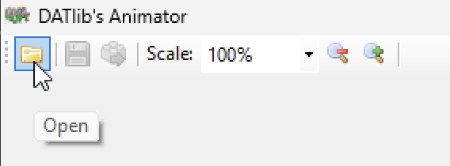
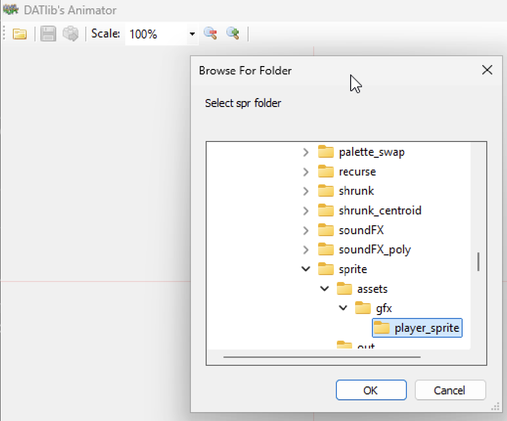
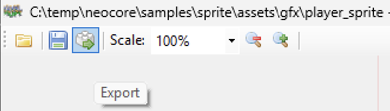

# NeoCore v2 to v3 Migration Guide

This comprehensive guide will help you migrate your NeoCore v2.x projects to NeoCore v3.0.0. The migration involves both **NeoCore framework changes** and **DATlib library changes**.

## Table of Contents
1. [Migration Overview](#migration-overview)
2. [Migration Tools and Scripts](#migration-tools-and-scripts)
3. [Animator Export](#animator-export)
4. [NeoCore Framework Migration](#neocore-framework-migration)
5. [DATlib Migration](#datlib-migration)
6. [Step-by-Step Migration Process](#step-by-step-migration-process)
7. [Testing Your Migration](#testing-your-migration)
8. [Common Issues and Solutions](#common-issues-and-solutions)

## Migration Overview

### What's Changed
- **NeoCore Framework**: Position types, function signatures, logging API
- **DATlib 0.2 → 0.3**: Complete sprite/scroller system redesign, new type system
- **Build System**: Updated toolchain and configuration

### Compatibility Status
- **Binary Compatibility**: ❌ Completely broken - full recompilation required
- **Source Compatibility**: ❌ Heavily broken - extensive code changes required

## Migration Tools and Scripts

### Official Migration Script (Recommended)

NeoCore v3 includes an official migration script that automates many migration tasks:

```bash
# Location: bootstrap/scripts/project/upgrade.bat
# Usage:
.\bootstrap\scripts\project\upgrade.bat -projectSrcPath "path\to\your\src" -projectNeocorePath "path\to\neocore"
```

**What the script does automatically:**
- ✅ **Project.xml migration**: Automatically updates structure for v3 compatibility
  - Adds missing v3 elements (`<platform>`, DAT setup, fixdata, emulator configs)
  - **Preserves user values**: Keeps existing values for `<name>`, `<version>`, `<makefile>`, `<neocorePath>`, `<buildPath>`, `<distPath>`, `<RaineExe>`, `<MameExe>`, `<CompilerPath>`
  - **Always overwrites**: `<includePath>` with `{{neocore}}\src-lib\include` (required for v3 compatibility)
  - Updates compiler configuration with v3 paths
  - **Migrates `<sound>` section**: Automatically wraps existing sound content in `<cd>` structure, preserving all sound elements
- ✅ **Build directory validation**: Checks for existing build directory and requires cleanup before proceeding
- ✅ **Code analysis**: Scans C files for v2/v3 compatibility issues and legacy patterns:
  - **Position function signatures**: Detects functions that return Vec2short instead of using output parameters:
    - `nc_get_position_gfx_animated_sprite()` return values and `.x/.y` access
    - `nc_get_position_gfx_animated_sprite_physic()` return values and `.x/.y` access
    - `nc_get_position_gfx_picture()` return values and `.x/.y` access
    - `nc_get_position_gfx_picture_physic()` return values and `.x/.y` access
    - `nc_get_position_gfx_scroller()` return values and `.x/.y` access
  - **Deprecated types**: Identifies Vec2short usage (replaced with Position)
  - **Legacy logging functions**: Detects old nc_log() patterns with label parameters:
    - `nc_log_word("label", value)` → Remove label parameter
    - `nc_log_int("label", value)` → Remove label parameter
    - `nc_log_short("label", value)` → Remove label parameter
    - `nc_log_bool("label", value)` → Remove label parameter
    - `nc_log_byte("label", value)` → Remove label parameter
    - `nc_log_box("label", value)` → Remove label parameter
    - `nc_log_dword("label", value)` → Remove label parameter
    - `nc_log_vec2short()` → Replace with nc_set_position_log(x, y) + nc_log_info()
  - **Removed functions**: Detects calls to functions removed in v3:
    - `nc_clear_vram()` → Replace with nc_clear_display() or nc_reset()
  - **Obsolete structure members**: Detects removed members from NeoCore v3:
    - `palCount` → Removed (handled internally)
    - `paletteMgr` → Removed (handled internally)
    - `spriteManager` → Removed (handled internally)
    - `fixMgrMemoryPool` → Removed (handled internally)
  - **C99 code patterns**: Detects variable declarations mixed with code (not supported in NeoCore C89/C90)
- ✅ **Deprecated file cleanup**: Automatically removes obsolete files:
  - `common_crt0_cd.s` (no longer needed)
  - `crt0_cd.s` (no longer needed)
- ✅ **Validation**: Checks .gitignore patterns and project structure:
  - **Missing patterns**: Detects missing recommended .gitignore entries:
    - `**/out/fix.bin` (generated build artifacts)
    - `**/out/char.bin` (generated build artifacts)
    - `/build/` or `build/` (build directory)
    - `/dist/` or `dist/` (distribution directory)
  - **Obsolete entries**: Identifies patterns that should be removed:
    - `externs.h` (no longer needed in v3)
  - **Path optimization**: Suggests absolute paths (`/build/` instead of `build/`) for better Git behavior
- ✅ **Backup creation**: Creates automatic backup in temp directory
- ✅ **Detailed logging**: Comprehensive migration log for debugging

**Migration process:**
1. Run the script with your project paths
2. Review compatibility warnings for C code
3. Manually update C code based on analysis results
4. Test your migrated project

### Manual Migration Procedure (Fallback)

If the automatic script fails or encounters issues, you can perform the migration manually. This section provides a complete step-by-step manual procedure.

#### Prerequisites for Manual Migration

1. **Backup your project:**
   ```bash
   # Create a full backup
   cp -r your_project your_project_backup

   # Or use git
   git tag pre-neocore-v3-migration
   git commit -am "Pre-migration backup"
   ```

2. **Ensure you have NeoCore v3 source:**
   - Download or clone NeoCore v3.0.0
   - Verify the version in `manifest.xml`

#### Step 1: Manual NeoCore Library Update

**Replace the NeoCore library files:**

1. **Backup your complete project** (create a full copy or git commit)
2. **Replace with the new v3 library** from your NeoCore v3 installation
3. **Update the toolchain** if you have custom modifications
4. **Copy new externs.h file:**
   ```bash
   # Copy the new v3 externs.h file to your project
   copy neocore_v3_installation\bootstrap\standalone\externs.h your_project\src\externs.h
   ```
5. **Replace any other NeoCore-specific folders** as needed

#### Step 2: Manual Project.xml Migration

**Update your `project.xml` file manually:**

1. **Add platform specification (after `<version>`):**
   ```xml
   <platform>cd</platform>
   ```

2. **Move `<neocorePath>` to top level (after `<distPath>`):**
   ```xml
   <!-- Move this element from bottom to top level -->
   <neocorePath>..\neocore</neocorePath>
   ```

3. **Update path templates:**
   ```xml
   <!-- Change these paths -->
   <buildPath>{{neocore}}\build</buildPath>
   <distPath>{{neocore}}\dist</distPath>
   ```

4. **Add DAT output specifications in chardata setup:**
   ```xml
   <setup>
     <starting_tile>256</starting_tile>
     <!-- ADD THESE LINES -->
     <charfile>out\char.bin</charfile>
     <mapfile>out\charMaps.s</mapfile>
     <palfile>out\charPals.s</palfile>
     <incfile>out\charInclude.h</incfile>
     <incprefix>../</incprefix>
   </setup>
   ```

5. **Wrap sound section in `<cd>` element:**
   ```xml
   <!-- OLD v2 structure -->
   <sound>
     <sfx>
       <pcm>assets\sounds\sfx\click.V1</pcm>
       <z80>assets\sounds\sfx\click.M1</z80>
     </sfx>
     <cdda>
       <dist>
         <iso>
           <format>mp3</format>
         </iso>
       </dist>
       <tracks>
         <track>
           <id>2</id>
           <file>assets\sounds\cdda\track_1.mp3</file>
           <pregap>00:02:00</pregap>
         </track>
       </tracks>
     </cdda>
   </sound>

   <!-- NEW v3 structure -->
   <sound>
     <cd>
       <sfx>
         <pcm>assets\sounds\sfx\click.V1</pcm>
         <z80>assets\sounds\sfx\click.M1</z80>
       </sfx>
       <cdda>
         <dist>
           <iso>
             <format>mp3</format>
           </iso>
         </dist>
         <tracks>
           <track>
             <id>2</id>
             <file>assets\sounds\cdda\track_1.mp3</file>
             <pregap>00:02:00</pregap>
           </track>
         </tracks>
       </cdda>
     </cd>
   </sound>
   ```

   **Note:**
   - The migration script automatically handles this transformation and preserves all existing sound elements including `pcm`, `z80`, `format`, `tracks`, and track details (`id`, `file`, `pregap`).
   - The `<sound>` section is automatically placed after `<gfx>` and before `<emulator>` in the correct XML order.
   - If no sound section exists in the original project.xml, none will be added (conditional inclusion).

6. **Update compiler configuration:**
   ```xml
   <compiler>
     <name>gcc</name>
     <version>2.95.2</version>
     <path>{{build}}\gcc\gcc-2.95.2</path>
     <!-- UPDATE THESE -->
     <includePath>{{neocore}}\src-lib\include</includePath>
     <libraryPath>{{build}}\lib</libraryPath>
     <!-- ADD THIS -->
     <crtPath>{{neocore}}\src-lib\crt</crtPath>
     <!-- UPDATE THIS -->
     <systemFile>
       <cd>{{neocore}}\src-lib\system\neocd.x</cd>
       <cartridge>{{neocore}}\src-lib\system\neocart.x</cartridge>
     </systemFile>
   </compiler>
   ```

#### Step 3: Manual File Cleanup

**Remove deprecated files:**

```bash
# Remove deprecated startup files
rm src/common_crt0_cd.s 2>/dev/null || true
rm src/crt0_cd.s 2>/dev/null || true

# Clean build artifacts
rm -rf build/* 2>/dev/null || true
rm -rf dist/* 2>/dev/null || true
rm src/*.o 2>/dev/null || true
rm src/*.iso 2>/dev/null || true
```

#### Step 4: Manual Makefile Update

**Replace your project's Makefile:**

```bash
# Backup current Makefile
cp src/Makefile src/Makefile_v2_backup

# Copy new v3 Makefile from NeoCore standalone template
cp path/to/neocore_v3/bootstrap/standalone/Makefile src/Makefile
```

#### Step 5: Manual C Code Migration

**Search and replace operations (use your IDE's find/replace):**

1. **Type system changes:**
   ```bash
   # Global replacements in all .c and .h files:
   Vec2short → Position
   ```

2. **Position getter functions:**
   ```bash
   # Find patterns like:
   Vec2short pos = nc_get_position_gfx_animated_sprite(sprite);

   # Replace with:
   Position pos;
   nc_get_position_gfx_animated_sprite(&sprite, &pos);
   ```

3. **Relative position function:**
   ```bash
   # Find patterns like:
   Vec2short relative = nc_get_relative_position(box, world_coord);

   # Replace with:
   Position relative;
   nc_get_relative_position(&relative, box, world_coord);
   ```

4. **Logging system migration:**
   ```bash
   # Replace basic logging:
   nc_log("message") → nc_log_info_line("message")

   # Replace ALL labeled logging functions (label parameter removed in v3):
   nc_log_word("Label", value) → nc_log_info("Label: "); nc_log_word(value); nc_log_next_line();
   nc_log_int("Label", value) → nc_log_info("Label: "); nc_log_int(value); nc_log_next_line();
   nc_log_short("Label", value) → nc_log_info("Label: "); nc_log_short(value); nc_log_next_line();
   nc_log_bool("Label", value) → nc_log_info("Label: "); nc_log_bool(value); nc_log_next_line();
   nc_log_byte("Label", value) → nc_log_info("Label: "); nc_log_byte(value); nc_log_next_line();
   nc_log_box("Label", value) → nc_log_info("Label: "); nc_log_box(value); nc_log_next_line();
   nc_log_dword("Label", value) → nc_log_info("Label: "); nc_log_dword(value); nc_log_next_line();

   # Replace type-specific logging:
   nc_log_vec2short("Pos", pos) → nc_set_position_log(pos.x, pos.y); nc_log_info("Pos");
   ```

5. **Structure member changes:**
   ```bash
   # Remove obsolete structure members (handled internally in v3):
   .palCount → Remove usage (palette count managed internally)
   .paletteMgr → Remove usage (palette manager handled internally)
   .spriteManager → Remove usage (sprite manager handled internally)
   .fixMgrMemoryPool → Remove usage (memory management handled internally)
   ```

6. **DATlib type changes:**
   ```bash
   # Global replacements:
   paletteInfo->palCount → paletteInfo->count
   sprite->currentStepNum → sprite->stepNum
   ```

#### Step 6: Manual Validation

**Check for common issues:**

1. **Verify project.xml syntax:**
   ```bash
   # Test XML parsing (if you have xmllint)
   xmllint --noout src/project.xml
   ```

2. **Check for missed patterns:**
   ```bash
   # Search for old patterns that might have been missed
   grep -r "Vec2short\|nc_log(" src/ --include="*.c" --include="*.h"
   grep -r "= nc_get_position_" src/ --include="*.c"

   # Check for obsolete structure members
   grep -r "\.palCount\|\.paletteMgr\|\.spriteManager\|\.fixMgrMemoryPool" src/ --include="*.c"

   # Check for labeled logging functions
   grep -r "nc_log_\w\+\s*(" src/ --include="*.c" | grep '\".*\"'

   # DATlib legacy patterns
   grep -r "->palCount\|->currentStepNum" src/ --include="*.c"
   ```

3. **Compilation test:**
   ```bash
   cd src
   make clean
   make
   ```

#### Step 7: Manual .gitignore Check

**Review and fix .gitignore patterns:**

1. **Check for incorrect patterns:**
   ```bash
   # Look for patterns that should be absolute
   grep "^build/\|^dist/" ../.gitignore
   ```

2. **Fix patterns manually:**
   ```bash
   # Edit .gitignore to use absolute paths
   build/ → /build/
   dist/ → /dist/
   ```

#### Troubleshooting Manual Migration

**Common manual migration issues:**

1. **XML parsing errors:**
   - Check for unclosed tags
   - Verify proper nesting
   - Ensure `<cd>` wrapper around sound elements

2. **Compilation errors:**
   - Missing `Position` declarations
   - Old function call patterns
   - Incorrect parameter counts

3. **Linking errors:**
   - Wrong library paths in project.xml
   - Missing CRT path configuration
   - Incorrect system file paths

4. **Runtime issues:**
   - Color values changed (check JOB_* constants)
   - Animation system behavior changes
   - Scroller system compatibility (may need rewrite)

**Manual verification checklist:**

- [ ] `project.xml` has `<platform>cd</platform>`
- [ ] `<neocorePath>` moved to top level
- [ ] Path templates use `{{neocore}}`
- [ ] Sound section wrapped in `<cd>`
- [ ] Compiler paths updated for v3
- [ ] Deprecated files removed
- [ ] All `Vec2short` replaced with `Position`
- [ ] Position getters use output parameters
- [ ] Logging calls updated
- [ ] Project compiles without errors
- [ ] .gitignore patterns use absolute paths

### Automated Search & Replace Script
```bash
#!/bin/bash
# migration-helper.sh

echo "NeoCore v2 to v3 Migration Helper"

# NeoCore Framework migrations
find . -name "*.c" -o -name "*.h" | xargs sed -i 's/Vec2short/Position/g'
# NOTE: nc_log_vec2short has been removed. Replace with:
# nc_log_vec2short("label", pos) → nc_set_position_log(pos.x, pos.y); nc_log_info("label");

# DATlib migrations
find . -name "*.c" -o -name "*.h" | xargs sed -i 's/->palCount/->count/g'
find . -name "*.c" -o -name "*.h" | xargs sed -i 's/->colNumber/\/\* MIGRATION NEEDED: colNumber removed \*\//g'
find . -name "*.c" -o -name "*.h" | xargs sed -i 's/->topBk/\/\* MIGRATION NEEDED: topBk removed \*\//g'
find . -name "*.c" -o -name "*.h" | xargs sed -i 's/->botBk/\/\* MIGRATION NEEDED: botBk removed \*\//g'
find . -name "*.c" -o -name "*.h" | xargs sed -i 's/->currentStepNum/->stepNum/g'

echo "Automated replacements completed. Manual review required for:"
echo "- Position getter function calls"
echo "- Logging function calls"
echo "- Scroller system (complete rewrite needed)"
echo "- Animation system (manual updates needed)"
```

### Validation Script
```bash
#!/bin/bash
# validate-migration.sh

echo "Checking for common migration issues..."

# Check for old function patterns
echo "=== Checking for old position getter patterns ==="
grep -r "= nc_get_position_" . --include="*.c" && echo "⚠️  Found old position getter patterns"

# Check for old logging patterns
echo "=== Checking for old logging patterns ==="
grep -r "nc_log(" . --include="*.c" && echo "⚠️  Found old nc_log() calls"

# Check for removed functions
echo "=== Checking for removed functions ==="
grep -r "nc_clear_vram(" . --include="*.c" && echo "⚠️  Found nc_clear_vram() calls - replace with nc_clear_display() or nc_reset()"

# Check for removed structures
echo "=== Checking for removed structures ==="
grep -r "animation \*" . --include="*.c" --include="*.h" && echo "⚠️  Found animation* usage"

# Check for removed members
echo "=== Checking for removed members ==="
grep -r "->colNumber\|->topBk\|->botBk\|->maxStep\|->currentAnimation" . --include="*.c" && echo "⚠️  Found removed member access"

echo "Validation complete. Review warnings above."
```

## Animator Export

⚠️ **CRITICAL STEP - MANDATORY FOR PROJECTS WITH ANIMATED SPRITES** ⚠️

**This step is REQUIRED if your NeoCore v2 project contains animated sprites.** Skipping this export will result in **runtime crashes** when running your migrated project on NeoCore v3.

After migrating your NeoCore v2 project, you **must** re-export your animations from the Animator tool to ensure compatibility with NeoCore v3. The animation data format has changed between v2 and v3, making this export step essential for projects using animated sprites.

### When is this step required?

✅ **Export Required:** Your project uses animated sprites (`.spr` files with animation data)
❌ **Export Not Needed:** Your project only uses static sprites without animations

### Export Process Overview

The Animator export process involves three main steps:
1. **Access the Animator menu**
2. **Browse to your project directory**
3. **Execute the export operation**

### Step-by-Step Visual Guide

#### Prerequisites: Launching the Animator

Before you can export your animations, you need to launch the Animator tool from your project directory:

1. **Navigate to your project source directory** (where your project files are located)
2. **Open a terminal/command prompt** in this directory
3. **Execute the command:**
   ```bash
   mak animator
   ```

#### Step 1: Access the Animator Menu



*Figure 1: Open the Animator menu to access export options*

Navigate to the Animator application and access the main menu where the export functionality is located.

#### Step 2: Browse to Project Directory



*Figure 2: Browse and select your project directory for export*

Use the directory browser to navigate to your NeoCore v2 project directory. Ensure you select the correct project folder that contains your animation assets.

#### Step 3: Execute Export Operation



*Figure 3: Execute the export process to generate compatible animation files*

Initiate the export process. The Animator will generate the necessary files in a format compatible with NeoCore v3.

### Export Completion

Once the export process is complete:
- ✅ Animation files are converted to v3 format
- ✅ Asset references are updated for compatibility
- ✅ Your project is ready for the migration script

**Critical Notes:**
- 🚨 **MANDATORY**: This export is **required** for projects with animated sprites - skipping will cause **runtime crashes**
- 💾 **Always backup** your project before running the export
- ✅ **Verify** that all animations export successfully
- 📋 **Check the export logs** for any warnings or errors
- 🔍 **Test animations** after export to ensure they work correctly

### Consequences of Skipping This Step

If you skip the Animator export for a project with animated sprites:
- ❌ **Runtime crashes** when loading animation data
- ❌ **Incompatible animation format** between v2 and v3
- ❌ **Missing or corrupted sprite animations**
- ❌ **Game will fail to start** or crash during sprite initialization

### Next Steps

After successfully exporting your animations:
1. Proceed with the [Migration Tools and Scripts](#migration-tools-and-scripts)
2. Run the official migration script
3. Validate your migrated project

## NeoCore Framework Migration

### 1. Type System Changes

#### 1.1 Position Type Replacement

**OLD (v2.x):**
```c
typedef struct Vec2short { short x; short y; } Vec2short;

// Usage
Vec2short player_pos = nc_get_position_gfx_animated_sprite(player);
Vec2short enemies[10];
```

**NEW (v3.0):**
```c
typedef struct Position { short x; short y; } Position;

// Usage
Position player_pos;
nc_get_position_gfx_animated_sprite(&player, &player_pos);
Position enemies[10];
```

**Migration Steps:**
1. **Global Search & Replace**: `Vec2short` → `Position`
2. **Update Box Structure Access**: No change needed (same member names)
3. **Update Array Declarations**: Change array types accordingly

#### 1.2 Function Signature Changes

**CRITICAL**: Position getter functions now use output parameters

**OLD (v2.x):**
```c
Vec2short pos = nc_get_position_gfx_animated_sprite(player);
Vec2short pic_pos = nc_get_position_gfx_picture(picture);
Vec2short scroll_pos = nc_get_position_gfx_scroller(scroller);

// Get relative position (returns by value)
Vec2short relative_pos = nc_get_relative_position(box, world_coord);

if (pos.x > 100 && pos.y < 50) {
    // Do something
}
```

**NEW (v3.0):**
```c
Position pos;
nc_get_position_gfx_animated_sprite(&player, &pos);
Position pic_pos;
nc_get_position_gfx_picture(&picture, &pic_pos);
Position scroll_pos;
nc_get_position_gfx_scroller(&scroller, &scroll_pos);

// Get relative position (now uses output parameter)
Position relative_pos;
nc_get_relative_position(&relative_pos, box, world_coord);

if (pos.x > 100 && pos.y < 50) {
    // Do something - usage remains the same
}
```

### 2. Logging System Overhaul

#### 2.1 Basic Logging Changes

**OLD (v2.x):**
```c
nc_log("Game started");
nc_log_word("Player HP", player_hp);
nc_log_int("Score", current_score);
nc_log_vec2short("Position", player_pos);
```

**NEW (v3.0):**
```c
nc_log_info_line("Game started");
nc_log_info("Player HP: "); nc_log_word(player_hp); nc_log_next_line();
nc_log_info("Score: "); nc_log_int(current_score); nc_log_next_line();
nc_set_position_log(player_pos.x, player_pos.y); nc_log_info("Position");
```

#### 2.2 Label Removal Pattern

All logging functions with label parameters have been removed:

**Removed Functions:**
- `nc_log_word(char *label, WORD value)` → `nc_log_word(WORD value)`
- `nc_log_int(char *label, int value)` → `nc_log_int(int value)`
- `nc_log_short(char *label, short value)` → `nc_log_short(short value)`
- `nc_log_vec2short(char *label, Vec2short vec)` → `nc_set_position_log(short x, short y)` + `nc_log_info(char *text)`
- `nc_clear_vram()` → Use `nc_clear_display()` or `nc_reset()` instead

#### 2.3 Type Removals

**BREAKING:** Hex color typedefs have been removed

**OLD (v2.x):**
```c
typedef char Hex_Color[3];
typedef char Hex_Packed_Color[5];

// Usage
Hex_Color hex_red = "FF0000";
Hex_Packed_Color hex_packed = "7FFF";
```

**NEW (v3.0):**
```c
// Types no longer available - use direct string literals or char arrays
char hex_red[3] = "FF0000";      // Manual array declaration
char hex_packed[5] = "7FFF";     // Manual array declaration
```

**Migration Required:**
- Replace `Hex_Color` declarations with `char[3]` arrays
- Replace `Hex_Packed_Color` declarations with `char[5]` arrays
- Update function parameters that used these types

### 3. Utility Functions

**OLD (v2.x):**
```c
void nc_update_mask(short x, short y, Vec2short vec[], Vec2short offset[], BYTE vector_max);
BOOL nc_vectors_collide(Box *box, Vec2short vec[], BYTE vector_max);
Vec2short relative = nc_get_relative_position(box, world_coord); // Returns by value
```

**NEW (v3.0):**
```c
void nc_update_mask(short x, short y, Position vec[], Position offset[], BYTE vector_max);
BOOL nc_vectors_collide(Box *box, Position vec[], BYTE vector_max);
Position relative;
nc_get_relative_position(&relative, box, world_coord); // Uses output parameter
```

## DATlib Migration

### 1. Type System Overhaul

#### 1.1 Fundamental Type Changes

**OLD (DATlib 0.2):**
```c
// Used WORD, DWORD, BYTE from system headers
typedef struct paletteInfo {
  WORD palCount;
  WORD data[0];
} paletteInfo;
```

**NEW (DATlib 0.3):**
```c
// New type definitions
#define bool unsigned short  // NEW type added

typedef struct paletteInfo {
  ushort count;      // palCount → count
  ushort data[0];    // WORD → ushort
} paletteInfo;
```

**Migration Required:**
- Replace `paletteInfo->palCount` with `paletteInfo->count`
- Update all `WORD` → `ushort`, `DWORD` → `uint`

### 2. Structure Complete Redesigns

#### 2.1 Scroller System (COMPLETE REWRITE REQUIRED)

**OLD (DATlib 0.2):**
```c
typedef struct scrollerInfo {
  WORD colSize;      // column size (words)
  WORD sprHeight;
  WORD mapWidth;
  WORD mapHeight;
  WORD map[0];       // map data
} scrollerInfo;

typedef struct scroller {
  WORD baseSprite;
  WORD basePalette;
  WORD colNumber[21];     // Column configuration
  WORD topBk, botBk;      // Background colors
  WORD scrlPosX, scrlPosY;
  scrollerInfo *info;
  //58 bytes
} scroller;
```

**NEW (DATlib 0.3):**
```c
typedef struct scrollerInfo {
  ushort stripSize;        // column size (BYTES!) - unit changed!
  ushort sprHeight;
  ushort mapWidth;
  ushort mapHeight;
  paletteInfo *palInfo;    // NEW: palette information
  colorStreamInfo *csInfo; // NEW: color stream system
  ushort *strips[0];       // NEW: replaces map array
} scrollerInfo;

typedef struct scroller {
  ushort baseSprite;
  ushort basePalette;
  short scrlPosX, scrlPosY;  // Type changed to short
  scrollerInfo *info;
  ushort config[32];         // NEW: replaces colNumber, topBk, botBk
  //76 bytes - size increased!
} scroller;
```

**Migration Strategy:**
⚠️ **Complete rewrite required** - the scroller system is fundamentally different
1. **Remove all direct access** to `colNumber`, `topBk`, `botBk`
2. **Implement new configuration system** using `config[32]` array
3. **Convert map data** to new strip-based system
4. **Update size calculations** (58 → 76 bytes)

#### 2.2 Animated Sprite System (MAJOR CHANGES)

**CRITICAL**: The `animation` structure has been **completely removed**

**OLD (DATlib 0.2):**
```c
typedef struct animation {
  WORD stepsCount;
  WORD repeats;
  animStep *data;
  struct animation *link;
} animation;

typedef struct aSprite {
  // ... position fields ...
  short currentStepNum;
  short maxStep;
  sprFrame *frames;           // frames bank (unused)
  animation *anims;           // anims bank
  animation *currentAnimation;
  animStep *steps;
  animStep *currentStep;
  DWORD counter;
  WORD repeats;
  // ...
  //50 bytes
} aSprite;
```

**NEW (DATlib 0.3):**
```c
// animation structure REMOVED entirely

typedef struct aSprite {
  // ... position fields ...
  ushort animID;              // Moved position
  ushort currentAnim;         // NEW: replaces currentAnimation
  ushort stepNum;             // Renamed from currentStepNum
  animStep *anims;            // anims bank
  animStep *steps;            // steps bank of current anim
  animStep *currentStep;      // current step
  sprFrame *currentFrame;     // current frame
  uint counter;               // DWORD → uint
  ushort repeats;
  // Removed: maxStep, frames, currentAnimation
  //42 bytes - size decreased!
} aSprite;
```

**Migration Steps:**
1. **Remove all `animation*` references**
2. **Replace `animation` arrays** with direct `animStep**` arrays
3. **Update member access:**
   - `currentStepNum` → `stepNum`
   - `currentAnimation` → use `currentAnim` index
   - Remove `maxStep`, `frames` access
4. **Handle size change** (50 → 42 bytes)

### 3. Job Meter Colors (BREAKING)

**⚠️ CRITICAL**: Almost all job meter color values have changed

**OLD (DATlib 0.2):**
```c
#define JOB_BLACK       0x0000
#define JOB_LIGHTRED    0x7f66
#define JOB_DARKRED     0xc900
#define JOB_GARKGREEN   0xa090  // Typo!
// ... many more
```

**NEW (DATlib 0.3):**
```c
#define JOB_BLACK       0x8000  // ⚠️ CHANGED!
#define JOB_LIGHTRED    0xcf88  // ⚠️ CHANGED!
#define JOB_DARKRED     0x8800  // ⚠️ CHANGED!
#define JOB_DARKGREEN   0x8080  // Fixed typo, changed value
// ⚠️ ALL colors have new values!

// NEW colors added:
#define JOB_LIGHTGREY   0x7bbb
#define JOB_GREY        0x8888
#define JOB_DARKGREY    0x8444
```

**Migration Required:**
⚠️ **Review ALL hardcoded color usage** - values changed significantly

### 4. Function Signature Changes

#### 4.1 Parameter Type Changes

**OLD (DATlib 0.2):**
```c
void pictureInit(picture *p, pictureInfo *pi, WORD baseSprite, BYTE basePalette, short posX, short posY, WORD flip);
void aSpriteInit(aSprite *as, spriteInfo *si, WORD baseSprite, BYTE basePalette, short posX, short posY, WORD anim, WORD flip);
void spritePoolInit(spritePool *sp, WORD baseSprite, WORD size);
```

**NEW (DATlib 0.3):**
```c
void pictureInit(picture *p, const pictureInfo *pi, ushort baseSprite, ushort basePalette, short posX, short posY, ushort flip);
void aSpriteInit(aSprite *as, const spriteInfo *si, ushort baseSprite, ushort basePalette, short posX, short posY, ushort anim, ushort flip, ushort flags);
void spritePoolInit(spritePool *sp, ushort baseSprite, ushort size, bool clearSprites);
```

**Migration Steps:**
1. **Update all function calls** to use `ushort` instead of `WORD`/`BYTE`
2. **Add `const` qualifiers** to info structure parameters
3. **Add new parameters:**
   - `aSpriteInit`: gained `flags` parameter
   - `spritePoolInit`: gained `clearSprites` parameter

#### 4.2 NeoCore Utility Function Changes

**CRITICAL**: `nc_get_relative_position` signature changed completely

**OLD (v2.x):**
```c
// Function returned Position by value
Vec2short nc_get_relative_position(Box box, Vec2short world_coord);

// Usage
Vec2short relative_pos = nc_get_relative_position(player_box, world_position);
```

**NEW (v3.0):**
```c
// Function uses output parameter (Position* first)
void nc_get_relative_position(Position *result, Box box, Position world_coord);

// Usage
Position relative_pos;
nc_get_relative_position(&relative_pos, player_box, world_position);
```

**Breaking Changes:**
- Return type changed from `Vec2short` to `void`
- First parameter is now `Position *result` (output parameter)
- Parameter types changed from `Vec2short` to `Position`
- Function no longer returns a value - result is written to output parameter

### 5. New Features in DATlib 0.3

#### 5.1 Color Streams (NEW)
```c
typedef struct colorStreamInfo { /* advanced color effects */ } colorStreamInfo;
typedef struct colorStream { /* ... */ } colorStream;

void colorStreamInit(colorStream *cs, const colorStreamInfo *csi, ushort basePalette, ushort config);
void colorStreamSetPos(colorStream *cs, ushort pos);
```

#### 5.2 Enhanced Fix Layer Support (NEW)
```c
void clearFixLayer2();
void clearFixLayer3();
// + job-based fix rendering with fixJobPut macro
```

#### 5.3 VRAM Manipulation Macros (NEW)
```c
#define VRAM_SPR_ADDR(s)   ((s)<<6)
#define VRAM_FIX_ADDR(x,y) (0x7000+(((x)<<5)+(y)))
#define VRAM_SHRINK_ADDR(s) (0x8000|(s))
// ... many more VRAM macros
```

## Step-by-Step Migration Process

### Phase 1: Prerequisites and Backup

1. **Backup Your Project**
   ```bash
   git tag pre-neocore-v3-migration
   git commit -am "Pre-migration backup"
   ```

2. **Choose Migration Method**
   - **Recommended**: Use the official migration script (see next section)
   - **Fallback**: Manual migration procedure (see Manual Migration section)

### Phase 2: Core Migration Steps

1. **Update NeoCore Framework**
   - Replace `Vec2short` with `Position`
   - Update position getter function calls
   - Migrate logging system calls

2. **Update DATlib Code**
   - Update type system (`WORD` → `ushort`, etc.)
   - Migrate palette structure access
   - Handle breaking changes in sprite/scroller systems

3. **Update Project Configuration**
   - Migrate `project.xml` to v3 format
   - Remove deprecated files
   - Update build configuration

### Phase 3: Testing and Validation

1. **Compilation Test**
   ```bash
   make clean
   make
   # Fix all compilation errors
   ```

2. **Functionality Testing**
   - Test all sprite animations
   - Test scroller functionality
   - Test logging output
   - Test collision detection
   - Verify color output (job meter colors changed!)

3. **Performance Validation**
   - Check memory usage (structure sizes changed)
   - Verify frame rate performance
   - Test under different load conditions

## Common Issues and Solutions

### Issue 1: Build Directory Exists Error
**Problem:** Migration script stops with "BUILD DIRECTORY EXISTS" error

**Root Cause:** An existing build directory from previous builds conflicts with migration process

**Solution:** Remove the build directory before running migration:
```bash
# Windows
rmdir /s /q "path\to\your\project\build"

# Linux/macOS
rm -rf path/to/your/project/build
```

### Issue 2: Compilation Errors with Position Getters
**Problem:**
```c
Vec2short pos = nc_get_position_gfx_animated_sprite(player); // Error
```

**Solution:**
```c
Position pos;
nc_get_position_gfx_animated_sprite(&player, &pos);
```

### Issue 3: Job Meter Colors Look Wrong
**Problem:** Colors appear different after migration

**Root Cause:** Job meter color constants have completely different values

**Solution:** Review and update all hardcoded color usage:
```c
// Check if you're using any JOB_* constants
// Verify visually that colors match your expectations
jobMeterColor(JOB_RED); // This is now a different red!
```

### Issue 4: Scroller System Crashes
**Problem:** Scroller code causes crashes or displays incorrectly

**Root Cause:** Scroller structures completely redesigned

**Solution:** Complete rewrite required - the old API is incompatible

### Issue 5: Animation System Not Working
**Problem:** Sprite animations don't play correctly

**Root Cause:** `animation` structure removed, `aSprite` structure changed

**Solution:**
1. Remove all `animation*` references
2. Update `aSprite` member access patterns
3. Use new animation control functions

### Issue 6: Logging Output Missing or Incorrect
**Problem:** Log messages don't appear or format incorrectly

**Solution:**
```c
// OLD
nc_log_word("HP", player_hp);

// NEW
nc_log_info("HP: ");
nc_log_word(player_hp);
nc_log_next_line();
```

## Performance Considerations

### Memory Usage Changes
- **aSprite**: 50 → 42 bytes (16% reduction)
- **scroller**: 58 → 76 bytes (31% increase)
- **Position getters**: No structure copying overhead

### Performance Improvements
- Position functions avoid structure copying
- Better memory layout with consistent types
- Enhanced color streaming capabilities
- More efficient animation system

## Benefits After Migration

### 1. Performance Improvements
- Reduced memory copying overhead
- Better cache performance with consistent types
- More efficient sprite animation system

### 2. Enhanced Capabilities
- **Color Streams**: Advanced color effects system
- **Enhanced Fix Layer**: Multi-layer support with job system
- **VRAM Manipulation**: Direct VRAM access macros
- **Better Logging**: More flexible logging system

### 3. Code Quality
- Consistent type system (`ushort` vs mixed `WORD`/`BYTE`)
- Better const-correctness
- More logical structure layouts
- Improved API design

## Conclusion

The migration from NeoCore v2 to v3 is a significant undertaking that will require substantial code changes. However, the improvements in performance, capabilities, and code quality make this migration worthwhile for ongoing projects.

**Expected Timeline:**
- **Small Projects**: 1-2 days
- **Medium Projects**: 1-2 weeks
- **Large Projects**: 2-4 weeks

**Critical Success Factors:**
1. **Complete backup** before starting
2. **Methodical approach** following this guide
3. **Thorough testing** of migrated functionality
4. **Visual validation** of color and animation changes

**Support Resources:**
- NeoCore v3 documentation
- Community forums
- Migration validation scripts (provided above)

Good luck with your migration!
