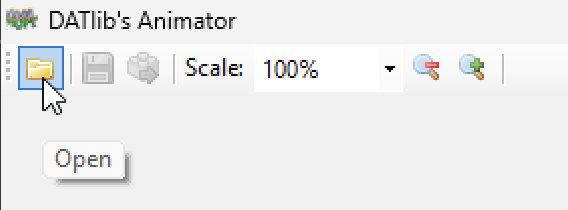
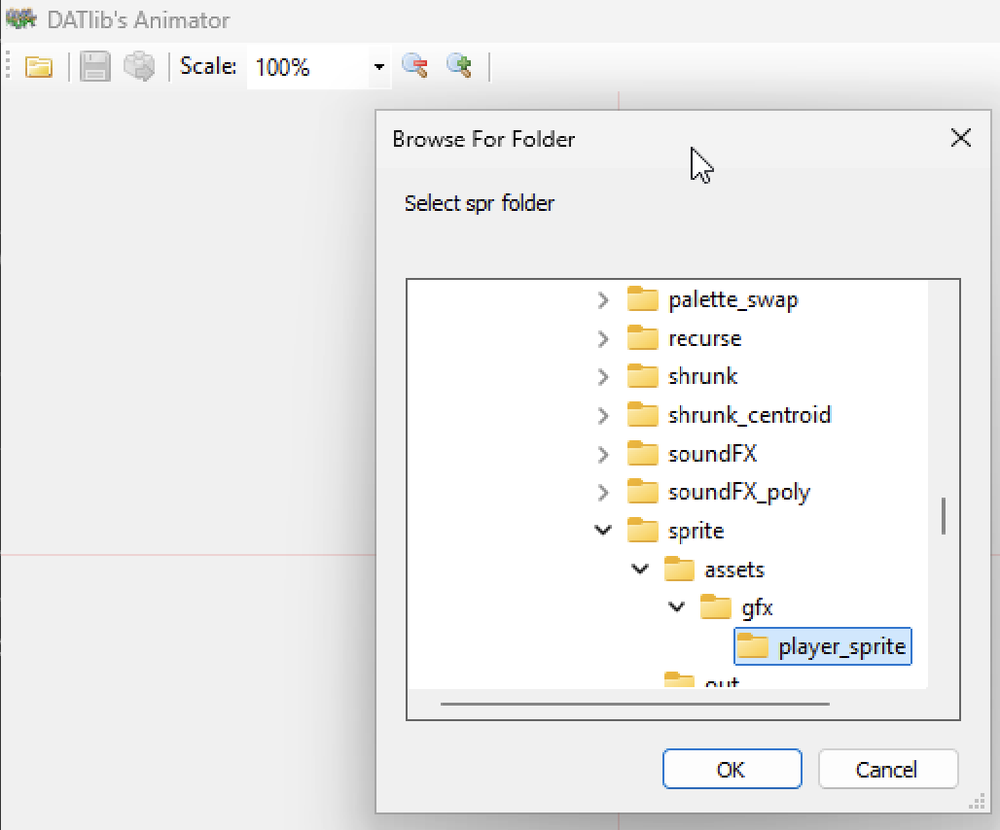
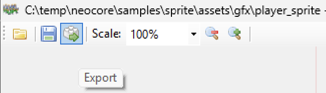

# NeoCore v2 to v3 Migration Guide

This guide helps you migrate your NeoCore v2.x projects to NeoCore v3.0.0.

## Table of Contents
1. [Overview](#overview)
2. [Prerequisites and Backup](#prerequisites-and-backup)
3. [Migration Script](#migration-script)
4. [Animator Export](#animator-export)
5. [Manual Migration Procedure (Fallback)](#manual-migration-procedure-fallback)
6. [DATlib Migration](#datlib-migration)
7. [Step-by-Step Migration Process](#step-by-step-migration-process)
8. [Conclusion](#conclusion)

## Overview

**Main changes:**
- **NeoCore**: Position types, function signatures, logging API
- **DATlib 0.2 → 0.3**: Complete sprite/scroller system redesign, new type system
- **Build**: Updated toolchain and configuration

## Prerequisites and Backup

**⚠️ IMPORTANT: Before starting any migration (automatic or manual), always backup your complete project.**

## Migration Script

**Official script (recommended):**

NeoCore v3 includes a migration script that automates many migration tasks:

```bash
# Usage:
cd bootstrap\scripts\project
.\upgrade.bat -projectSrcPath "path\to\your\src" -projectNeocorePath "path\to\neocore"
```

**What the script does automatically:**
- ✅ **Project.xml migration**: Automatically updates structure for v3 compatibility
  - Adds missing v3 elements (`<platform>`, DAT setup, fixdata, emulator configs)
  - **Preserves user values**: Keeps existing values for `<name>`, `<version>`, `<makefile>`, `<neocorePath>`, `<buildPath>`, `<distPath>`, `<RaineExe>`, `<MameExe>`, `<CompilerPath>`
  - **Always overwrites**: `<includePath>` with `{{neocore}}\src-lib\include` (required for v3 compatibility)
  - Updates compiler configuration with v3 paths
  - **Migrates `<sound>` section**: Automatically wraps existing sound content in `<cd>` structure, preserving all sound elements
- ✅ **Code analysis**: Scans C files for v2/v3 compatibility issues and legacy patterns:
  - **Position function signatures**: Detects functions that return Vec2short instead of using output parameters:
    - `nc_get_position_gfx_animated_sprite()` return values and `.x/.y` access
    - `nc_get_position_gfx_animated_sprite_physic()` return values and `.x/.y` access
    - `nc_get_position_gfx_picture()` return values and `.x/.y` access
    - `nc_get_position_gfx_picture_physic()` return values and `.x/.y` access
    - `nc_get_position_gfx_scroller()` return values and `.x/.y` access
  - **Deprecated types**: Identifies Vec2short usage (replaced with Position)
  - **Legacy logging functions**: Detects old nc_log() patterns with label parameters:
    - `nc_log_word("label", value)` → Remove label parameter
    - `nc_log_int("label", value)` → Remove label parameter
    - `nc_log_short("label", value)` → Remove label parameter
    - `nc_log_bool("label", value)` → Remove label parameter
    - `nc_log_byte("label", value)` → Remove label parameter
    - `nc_log_box("label", value)` → Remove label parameter
    - `nc_log_dword("label", value)` → Remove label parameter
    - `nc_log_vec2short()` → Replace with nc_set_position_log(x, y) + nc_log_info()
  - **Removed functions**: Detects calls to functions removed in v3:
    - `nc_clear_vram()` → Replace with nc_clear_display() or nc_reset()
  - **Obsolete structure members**: Detects removed members from NeoCore v3:
    - `palCount` → Removed (handled internally)
    - `paletteMgr` → Removed (handled internally)
    - `spriteManager` → Removed (handled internally)
    - `fixMgrMemoryPool` → Removed (handled internally)
- ✅ **Deprecated file cleanup**: Automatically removes obsolete files:
  - `common_crt0_cd.s` (no longer needed)
  - `crt0_cd.s` (no longer needed)
- ✅ **Validation**: Checks .gitignore patterns and project structure:
  - **Missing patterns**: Detects missing recommended .gitignore entries:
    - `**/out/fix.bin` (generated build artifacts)
    - `**/out/char.bin` (generated build artifacts)
    - `/build/` or `build/` (build directory)
    - `/dist/` or `dist/` (distribution directory)
  - **Path optimization**: Suggests absolute paths (`/build/` instead of `build/`) for better Git behavior
- ✅ **Detailed logging**: Comprehensive migration log for debugging

**Migration process:**
1. Run the script with your project paths
2. Review compatibility warnings for C code
3. Manually update C code based on analysis results
4. Export animations if your project uses animated sprites (see Animator Export section)

## Animator Export

⚠️ **CRITICAL STEP - MANDATORY FOR PROJECTS WITH ANIMATED SPRITES** ⚠️

**This step is REQUIRED if your NeoCore v2 project contains animated sprites.** Skipping this export will result in **runtime crashes** when running your migrated project on NeoCore v3.

After migrating your NeoCore v2 project, you **must** re-export your animations from the Animator tool to ensure compatibility with NeoCore v3. The animation data format has changed between v2 and v3, making this export step essential for projects using animated sprites.

### When is this step required?

✅ **Export Required:** Your project uses animated sprites\
❌ **Export Not Needed:** Your project only uses static sprites without animations

### Export Process Overview

The Animator export process involves three main steps:
1. **Access the Animator menu**
2. **Browse to your project directory**
3. **Execute the export operation**

### Step-by-Step Visual Guide

#### Prerequisites: Launching the Animator

Before you can export your animations, you need to launch the Animator tool from your project directory:

1. **Navigate to your project source directory** (where your project files are located)
2. **Open a terminal/command prompt** in this directory
3. **Execute the command:**
   ```bash
   mak animator
   ```

#### Step 1: Access the Animator Menu



*Figure 1: Open the Animator menu to access export options*

Navigate to the Animator application and access the main menu where the export functionality is located.

#### Step 2: Browse to Project Directory



*Figure 2: Browse and select your project directory for export*

Use the directory browser to navigate to your NeoCore v2 project directory. Ensure you select the correct project folder that contains your animation assets.

#### Step 3: Execute Export Operation



*Figure 3: Execute the export process to generate compatible animation files*

Initiate the export process. The Animator will generate the necessary files in a format compatible with NeoCore v3.

**Critical Notes:**
- 🚨 **MANDATORY**: This export is **required** for projects with animated sprites - skipping will cause **runtime crashes**
- 💾 **Always backup** your project before running the export

### Consequences of Skipping This Step

If you skip the Animator export for a project with animated sprites:
- ❌ **Runtime crashes** when loading animation data
- ❌ **Incompatible animation format** between v2 and v3
- ❌ **Missing or corrupted sprite animations**
- ❌ **Game will fail to start** or crash during sprite initialization

## Manual Migration Procedure (Fallback)

If the automatic script fails or encounters issues, you can perform the migration manually. This section provides a complete step-by-step manual procedure.

#### Prerequisites for Manual Migration

**Ensure you have NeoCore v3 source:**
- Download or clone NeoCore v3.0.0

#### Step 1: Manual NeoCore Library Update

**Replace the NeoCore library files:**

1. **Backup your complete project** (create a full copy)
2. **Replace NeoCore library components:**
   - Delete your existing `neocore\src-lib` folder in your project
   - Copy the `src-lib` folder from your NeoCore v3 installation to your project's `neocore\src-lib`
   - Delete your existing `neocore\toolchain` folder in your project
   - Copy the `toolchain` folder from your NeoCore v3 installation to your project's `neocore\toolchain`
3. **Copy new externs.h file:**
   - Copy `externs.h` from `neocore_v3_installation\bootstrap\standalone\`
   - Place it in your project's `src\` directory, replacing the old one

#### Step 2: Manual Project.xml Migration

**Update your `project.xml` file manually:**

1. **Add platform specification (after `<version>`):**
   ```xml
   <platform>cd</platform>
   ```

2. **Move `<neocorePath>` to top level (after `<distPath>`):**
   ```xml
   <!-- Move this element from bottom to top level -->
   <neocorePath>..\neocore</neocorePath>
   ```

3. **Update path templates:**
   ```xml
   <!-- Change these paths -->
   <buildPath>{{neocore}}\build</buildPath>
   <distPath>{{neocore}}\dist</distPath>
   ```

4. **Add DAT output specifications in chardata setup:**
   ```xml
   <setup>
     <starting_tile>256</starting_tile>
     <!-- ADD THESE LINES -->
     <charfile>out\char.bin</charfile>
     <mapfile>out\charMaps.s</mapfile>
     <palfile>out\charPals.s</palfile>
     <incfile>out\charInclude.h</incfile>
     <incprefix>../</incprefix>
   </setup>
   ```

5. **Wrap sound section in `<cd>` element:**
   ```xml
   <!-- OLD v2 structure -->
   <sound>
     <sfx>
       <pcm>assets\sounds\sfx\click.V1</pcm>
       <z80>assets\sounds\sfx\click.M1</z80>
     </sfx>
     <cdda>
       <dist>
         <iso>
           <format>mp3</format>
         </iso>
       </dist>
       <tracks>
         <track>
           <id>2</id>
           <file>assets\sounds\cdda\track_1.mp3</file>
           <pregap>00:02:00</pregap>
         </track>
       </tracks>
     </cdda>
   </sound>

   <!-- NEW v3 structure -->
   <sound>
     <cd>
       <sfx>
         <pcm>assets\sounds\sfx\click.V1</pcm>
         <z80>assets\sounds\sfx\click.M1</z80>
       </sfx>
       <cdda>
         <dist>
           <iso>
             <format>mp3</format>
           </iso>
         </dist>
         <tracks>
           <track>
             <id>2</id>
             <file>assets\sounds\cdda\track_1.mp3</file>
             <pregap>00:02:00</pregap>
           </track>
         </tracks>
       </cdda>
     </cd>
   </sound>
   ```

   **Note:**
   - The migration script automatically handles this transformation and preserves all existing sound elements including `pcm`, `z80`, `format`, `tracks`, and track details (`id`, `file`, `pregap`).
   - The `<sound>` section is automatically placed after `<gfx>` and before `<emulator>` in the correct XML order.
   - If no sound section exists in the original project.xml, none will be added (conditional inclusion).

6. **Update compiler configuration:**
   ```xml
   <compiler>
     <name>gcc</name>
     <version>2.95.2</version>
     <path>{{build}}\gcc\gcc-2.95.2</path>
     <!-- UPDATE THESE -->
     <includePath>{{neocore}}\src-lib\include</includePath>
     <libraryPath>{{build}}\lib</libraryPath>
     <!-- ADD THIS -->
     <crtPath>{{neocore}}\src-lib\crt</crtPath>
     <!-- UPDATE THIS -->
     <systemFile>
       <cd>{{neocore}}\src-lib\system\neocd.x</cd>
       <cartridge>{{neocore}}\src-lib\system\neocart.x</cartridge>
     </systemFile>
   </compiler>
   ```

#### Step 3: Manual File Cleanup

**Remove deprecated files:**

1. **Delete deprecated startup files:**
   - Remove `src\common_crt0_cd.s` if it exists
   - Remove `src\crt0_cd.s` if it exists

2. **Clean build artifacts:**
   - Delete the `build` directory
   - Delete the `dist` directory

#### Step 4: Manual Makefile Update

**Replace your project's Makefile:**

1. **Copy new v3 Makefile:**
   - Copy the Makefile from `neocore_v3_installation\bootstrap\standalone\Makefile`
   - Place it in your project's `src\Makefile` location

#### Step 5: Manual C Code Migration

**Search and replace operations (use your IDE's find/replace):**

1. **Type system changes:**
   ```bash
   # Global replacements in all .c and .h files:
   Vec2short → Position
   ```

2. **Position getter functions:**
   ```bash
   # Find patterns like:
   Vec2short pos = nc_get_position_gfx_animated_sprite(sprite);

   # Replace with:
   Position pos;
   nc_get_position_gfx_animated_sprite(&sprite, &pos);
   ```

3. **Position getter functions with direct access:**
   ```bash
   # Find patterns like:
   nc_get_position_gfx_animated_sprite(sprite).x
   nc_get_position_gfx_picture(picture).y
   nc_get_position_gfx_scroller(scroller).x
   nc_get_position_gfx_animated_sprite_physic(sprite).y
   nc_get_position_gfx_picture_physic(picture).x

8. **Position getter functions with direct access:**
   ```bash
   # Find patterns like:
   nc_get_position_gfx_animated_sprite(sprite).x
   nc_get_position_gfx_picture(picture).y
   nc_get_position_gfx_scroller(scroller).x
   nc_get_position_gfx_animated_sprite_physic(sprite).y
   nc_get_position_gfx_picture_physic(picture).x

   # Replace with:
   Position pos;
   nc_get_position_gfx_animated_sprite(&sprite, &pos);
   // Then use pos.x or pos.y
   ```

9. **Relative position function:**
   ```bash
   # Find patterns like:
   Vec2short relative = nc_get_relative_position(box, world_coord);

   # Replace with:
   Position relative;
   nc_get_relative_position(&relative, box, world_coord);
   ```

10. **Logging system migration:**
   ```bash
   # Replace basic logging:
   nc_log("message") → nc_log_info_line("message")

   # Replace ALL labeled logging functions (label parameter removed in v3):
   nc_log_word("Label", value) → nc_log_info("Label: "); nc_log_word(value); nc_log_next_line();
   nc_log_int("Label", value) → nc_log_info("Label: "); nc_log_int(value); nc_log_next_line();
   nc_log_short("Label", value) → nc_log_info("Label: "); nc_log_short(value); nc_log_next_line();
   nc_log_bool("Label", value) → nc_log_info("Label: "); nc_log_bool(value); nc_log_next_line();
   nc_log_byte("Label", value) → nc_log_info("Label: "); nc_log_byte(value); nc_log_next_line();
   nc_log_box("Label", value) → nc_log_info("Label: "); nc_log_box(value); nc_log_next_line();
   nc_log_dword("Label", value) → nc_log_info("Label: "); nc_log_dword(value); nc_log_next_line();

   # Replace type-specific logging:
   nc_log_vec2short("Pos", pos) → nc_set_position_log(pos.x, pos.y); nc_log_info("Pos");

   # Note: Logging functions no longer add automatic line breaks
   # Use nc_log_info_line() for automatic line breaks or nc_log_next_line() manually
   ```

11. **Removed functions and types:**
   ```bash
   # Replace removed function:
   nc_clear_vram() → nc_clear_display() or nc_reset()

   # Remove removed types (no replacement needed):
   typedef char Hex_Color[3]; → Remove (no longer supported)
   typedef char Hex_Packed_Color[5]; → Remove (no longer supported)
   ```

12. **Display function return values:**
   ```bash
   # Display functions now return sprite index (WORD) instead of void:
   nc_display_gfx_picture() → now returns sprite index
   nc_display_gfx_animated_sprite() → now returns sprite index
   nc_display_gfx_scroller() → now returns sprite index
   nc_init_display_gfx_picture() → now returns sprite index
   nc_init_display_gfx_animated_sprite() → now returns sprite index
   nc_init_display_gfx_scroller() → now returns sprite index

   # You can capture the sprite index if needed:
   WORD sprite_index = nc_display_gfx_picture(&picture);
   ```

13. **DATlib structure changes:**
   ```bash
   # DATlib palCount member deprecated, replaced with count:
   palette_data.palCount → palette_data.count
   paletteInfo->palCount → paletteInfo->count

   # NeoCore object palInfo->palCount changes:
   object.palInfo->palCount → object.palInfo->count
   object_ptr->palInfo->palCount → object_ptr->palInfo->count

   # DATlib animated sprite member renamed:
   sprite.currentStepNum → sprite.stepNum
   sprite_ptr->currentStepNum → sprite_ptr->stepNum
   ```

14. **DATlib type changes:**
   ```bash
   # DATlib type replacements:
   WORD type_var → ushort type_var
   DWORD type_var → uint type_var
   ```

15. **Removed structure members (NeoCore v3):**
   ```bash
   # These structure members were removed - remove all usage:
   .palCount         → Remove (handled internally)
   .paletteMgr       → Remove (handled internally)
   .spriteManager    → Remove (handled internally)
   .fixMgrMemoryPool → Remove (handled internally)
   .sprites          → Check v3 documentation for replacement
   .frames           → Check v3 documentation for replacement
   ```

16. **C89/C90 compatibility (variable declarations):**
   ```bash
   # NeoCore v3 requires C89/C90 - move ALL variable declarations to function start:

   // ❌ WRONG (C99 style):
   void function() {
       int a = 5;
       some_code();
       int b = 10;  // Declaration after code
   }

   // ✅ CORRECT (C89/C90 style):
   void function() {
       int a = 5;
       int b;       // All declarations at top
       some_code();
       b = 10;
   }
   ```

7. **Structure member changes:**
   ```bash
   # Remove obsolete structure members (handled internally in v3):
   .palCount → Remove usage (palette count managed internally)
   .paletteMgr → Remove usage (palette manager handled internally)
   .spriteManager → Remove usage (sprite manager handled internally)
   .fixMgrMemoryPool → Remove usage (memory management handled internally)
   .sprites → Remove usage (handled internally)
   .frames → Remove usage (handled internally)
   ```

8. **DATlib structure changes:**
   ```bash
   # Global replacements:
   paletteInfo->palCount → paletteInfo->count
   sprite->currentStepNum → sprite->stepNum

   # For nested palette access:
   object.palInfo->palCount → object.palInfo->count
   object->palInfo->palCount → object->palInfo->count
   ```

9. **C89/C90 compliance (variable declarations):**
   ```bash
   # Ensure all variable declarations are at the beginning of blocks
   # Move any variables declared after code statements to the top of the function
   # This is required for C89/C90 compliance used by NeoCore
   ```

#### Step 6: Animator Export (If Required)

**⚠️ CRITICAL: Export animations if your project uses animated sprites**

If your project contains animated sprites, you **must** perform the Animator export step before validation.

**→ See the complete [Animator Export section](#animator-export) above for detailed instructions.**

**Skip this step only if your project uses static sprites exclusively.**

#### Step 7: Manual Validation

**Check for common issues:**

1. **Compilation test:**
   ```cmd
   cd src
   mak clean
   mak sprite
   mak
   ```

#### Step 8: Manual .gitignore Check

**Review and fix .gitignore patterns:**

1. **Check for incorrect patterns:**
   - Open your `.gitignore` file in a text editor
   - Look for patterns that use relative paths like `build/` or `dist/`
   - Check if build artifact patterns are missing: `**/out/fix.bin` and `**/out/char.bin`

2. **Fix patterns manually:**
   - Edit your `.gitignore` file to use absolute paths
   - Change `build/` to `/build/`
   - Change `dist/` to `/dist/`
   - Add missing patterns if not found:
     - `**/out/fix.bin`
     - `**/out/char.bin`

## DATlib Migration

### 1. Type System Overhaul

#### 1.1 Fundamental Type Changes

**OLD (DATlib 0.2):**
```c
// Used WORD, DWORD, BYTE from system headers
typedef struct paletteInfo {
  WORD palCount;
  WORD data[0];
} paletteInfo;
```

**NEW (DATlib 0.3):**
```c
// New type definitions
#define bool unsigned short  // NEW type added

typedef struct paletteInfo {
  ushort count;      // palCount → count
  ushort data[0];    // WORD → ushort
} paletteInfo;
```

**Migration Required:**
- Replace `paletteInfo->palCount` with `paletteInfo->count`
- Update all `WORD` → `ushort`, `DWORD` → `uint`

### 2. Structure Complete Redesigns

#### 2.1 Scroller System (COMPLETE REWRITE REQUIRED)

**OLD (DATlib 0.2):**
```c
typedef struct scrollerInfo {
  WORD colSize;      // column size (words)
  WORD sprHeight;
  WORD mapWidth;
  WORD mapHeight;
  WORD map[0];       // map data
} scrollerInfo;

typedef struct scroller {
  WORD baseSprite;
  WORD basePalette;
  WORD colNumber[21];     // Column configuration
  WORD topBk, botBk;      // Background colors
  WORD scrlPosX, scrlPosY;
  scrollerInfo *info;
  //58 bytes
} scroller;
```

**NEW (DATlib 0.3):**
```c
typedef struct scrollerInfo {
  ushort stripSize;        // column size (BYTES!) - unit changed!
  ushort sprHeight;
  ushort mapWidth;
  ushort mapHeight;
  paletteInfo *palInfo;    // NEW: palette information
  colorStreamInfo *csInfo; // NEW: color stream system
  ushort *strips[0];       // NEW: replaces map array
} scrollerInfo;

typedef struct scroller {
  ushort baseSprite;
  ushort basePalette;
  short scrlPosX, scrlPosY;  // Type changed to short
  scrollerInfo *info;
  ushort config[32];         // NEW: replaces colNumber, topBk, botBk
  //76 bytes - size increased!
} scroller;
```

**Migration Strategy:**
⚠️ **Complete rewrite required** - the scroller system is fundamentally different
1. **Remove all direct access** to `colNumber`, `topBk`, `botBk`
2. **Implement new configuration system** using `config[32]` array
3. **Convert map data** to new strip-based system
4. **Update size calculations** (58 → 76 bytes)

#### 2.2 Animated Sprite System (MAJOR CHANGES)

**CRITICAL**: The `animation` structure has been **completely removed**

**OLD (DATlib 0.2):**
```c
typedef struct animation {
  WORD stepsCount;
  WORD repeats;
  animStep *data;
  struct animation *link;
} animation;

typedef struct aSprite {
  // ... position fields ...
  short currentStepNum;
  short maxStep;
  sprFrame *frames;           // frames bank (unused)
  animation *anims;           // anims bank
  animation *currentAnimation;
  animStep *steps;
  animStep *currentStep;
  DWORD counter;
  WORD repeats;
  // ...
  //50 bytes
} aSprite;
```

**NEW (DATlib 0.3):**
```c
// animation structure REMOVED entirely

typedef struct aSprite {
  // ... position fields ...
  ushort animID;              // Moved position
  ushort currentAnim;         // NEW: replaces currentAnimation
  ushort stepNum;             // Renamed from currentStepNum
  animStep *anims;            // anims bank
  animStep *steps;            // steps bank of current anim
  animStep *currentStep;      // current step
  sprFrame *currentFrame;     // current frame
  uint counter;               // DWORD → uint
  ushort repeats;
  // Removed: maxStep, frames, currentAnimation
  //42 bytes - size decreased!
} aSprite;
```

**Migration Steps:**
1. **Remove all `animation*` references**
2. **Replace `animation` arrays** with direct `animStep**` arrays
3. **Update member access:**
   - `currentStepNum` → `stepNum`
   - `currentAnimation` → use `currentAnim` index
   - Remove `maxStep`, `frames` access
4. **Handle size change** (50 → 42 bytes)

### 3. Job Meter Colors (BREAKING)

**⚠️ CRITICAL**: Almost all job meter color values have changed

**OLD (DATlib 0.2):**
```c
#define JOB_BLACK       0x0000
#define JOB_LIGHTRED    0x7f66
#define JOB_DARKRED     0xc900
#define JOB_GARKGREEN   0xa090  // Typo!
// ... many more
```

**NEW (DATlib 0.3):**
```c
#define JOB_BLACK       0x8000  // ⚠️ CHANGED!
#define JOB_LIGHTRED    0xcf88  // ⚠️ CHANGED!
#define JOB_DARKRED     0x8800  // ⚠️ CHANGED!
#define JOB_DARKGREEN   0x8080  // Fixed typo, changed value
// ⚠️ ALL colors have new values!

// NEW colors added:
#define JOB_LIGHTGREY   0x7bbb
#define JOB_GREY        0x8888
#define JOB_DARKGREY    0x8444
```

**Migration Required:**
⚠️ **Review ALL hardcoded color usage** - values changed significantly

### 4. Function Signature Changes

#### 4.1 Parameter Type Changes

**OLD (DATlib 0.2):**
```c
void pictureInit(picture *p, pictureInfo *pi, WORD baseSprite, BYTE basePalette, short posX, short posY, WORD flip);
void aSpriteInit(aSprite *as, spriteInfo *si, WORD baseSprite, BYTE basePalette, short posX, short posY, WORD anim, WORD flip);
void spritePoolInit(spritePool *sp, WORD baseSprite, WORD size);
```

**NEW (DATlib 0.3):**
```c
void pictureInit(picture *p, const pictureInfo *pi, ushort baseSprite, ushort basePalette, short posX, short posY, ushort flip);
void aSpriteInit(aSprite *as, const spriteInfo *si, ushort baseSprite, ushort basePalette, short posX, short posY, ushort anim, ushort flip, ushort flags);
void spritePoolInit(spritePool *sp, ushort baseSprite, ushort size, bool clearSprites);
```

**Migration Steps:**
1. **Update all function calls** to use `ushort` instead of `WORD`/`BYTE`
2. **Add `const` qualifiers** to info structure parameters
3. **Add new parameters:**
   - `aSpriteInit`: gained `flags` parameter
   - `spritePoolInit`: gained `clearSprites` parameter

#### 4.2 NeoCore Utility Function Changes

**CRITICAL**: `nc_get_relative_position` signature changed completely

**OLD (v2.x):**
```c
// Function returned Position by value
Vec2short nc_get_relative_position(Box box, Vec2short world_coord);

// Usage
Vec2short relative_pos = nc_get_relative_position(player_box, world_position);
```

**NEW (v3.0):**
```c
// Function uses output parameter (Position* first)
void nc_get_relative_position(Position *result, Box box, Position world_coord);

// Usage
Position relative_pos;
nc_get_relative_position(&relative_pos, player_box, world_position);
```

**Breaking Changes:**
- Return type changed from `Vec2short` to `void`
- First parameter is now `Position *result` (output parameter)
- Parameter types changed from `Vec2short` to `Position`
- Function no longer returns a value - result is written to output parameter

### 5. New Features in DATlib 0.3

#### 5.1 Color Streams (NEW)
```c
typedef struct colorStreamInfo { /* advanced color effects */ } colorStreamInfo;
typedef struct colorStream { /* ... */ } colorStream;

void colorStreamInit(colorStream *cs, const colorStreamInfo *csi, ushort basePalette, ushort config);
void colorStreamSetPos(colorStream *cs, ushort pos);
```

#### 5.2 Enhanced Fix Layer Support (NEW)
```c
void clearFixLayer2();
void clearFixLayer3();
// + job-based fix rendering with fixJobPut macro
```

#### 5.3 VRAM Manipulation Macros (NEW)
```c
#define VRAM_SPR_ADDR(s)   ((s)<<6)
#define VRAM_FIX_ADDR(x,y) (0x7000+(((x)<<5)+(y)))
#define VRAM_SHRINK_ADDR(s) (0x8000|(s))
# ... many more VRAM macros
```

## Step-by-Step Migration Process

### Phase 1: Prerequisites and Backup

1. **Backup Your Project**
   ```bash
   git tag pre-neocore-v3-migration
   git commit -am "Pre-migration backup"
   ```

2. **Choose Migration Method**
   - **Recommended**: Use the official migration script (see next section)
   - **Fallback**: Manual migration procedure (see Manual Migration section)

### Phase 2: Core Migration Steps

1. **Update NeoCore Framework**
   - Replace `Vec2short` with `Position`
   - Update position getter function calls
   - Migrate logging system calls

2. **Update DATlib Code**
   - Update type system (`WORD` → `ushort`, etc.)
   - Migrate palette structure access
   - Handle breaking changes in sprite/scroller systems

3. **Update Project Configuration**
   - Migrate `project.xml` to v3 format
   - Remove deprecated files
   - Update build configuration

4. **Export Animations (If Required)**
   - ⚠️ **CRITICAL**: Export animations if your project uses animated sprites
   - Use the Animator tool to re-export all animations for v3 compatibility
   - **Skip this step only** if your project uses static sprites exclusively
   - **→ See [Animator Export section](#animator-export) for complete instructions**

### Phase 3: Testing and Validation

1. **Compilation Test**
   ```bash
   make clean
   make
   # Fix all compilation errors
   ```

2. **Functionality Testing**
   - Test all sprite animations
   - Test scroller functionality
   - Test logging output
   - Test collision detection
   - Verify color output (job meter colors changed!)

## Conclusion

NeoCore v3 migration requires updating code.

Follow the migration script or manual steps above. Good luck!
